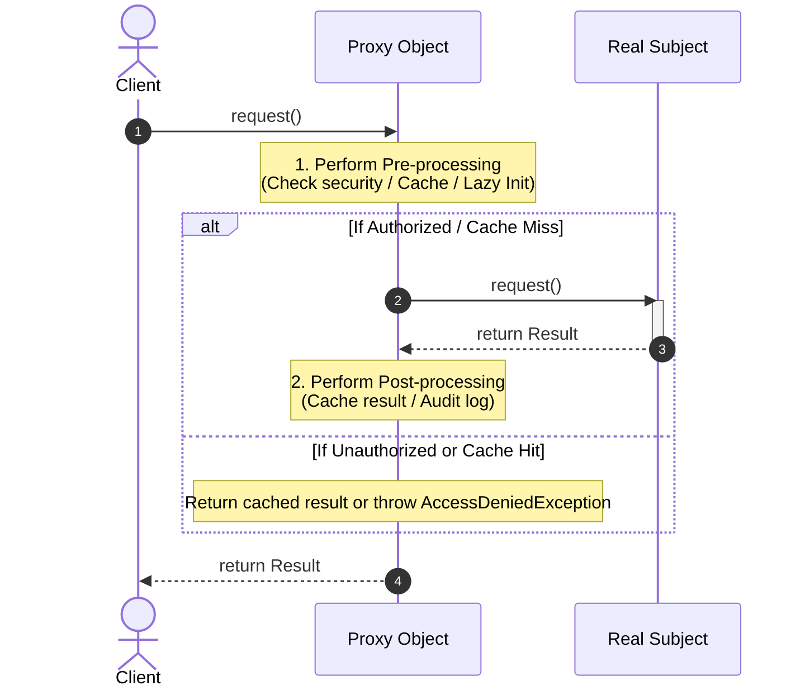

# Module 1: Proxy Pattern Fundamentals

## 1. What is the Proxy Pattern?

The **Proxy Pattern** is a structural design pattern that provides a **surrogate, placeholder, or representative object** to control access to another target object (known as the `RealSubject`).

A Proxy acts as an intermediary or buffer between the client and the actual object. By intercepting calls to the target object, a proxy can perform auxiliary tasks such as **lazy initialization**, **access control**, **caching**, **logging**, **rate limiting**, or **remote call encapsulation**—all without modifying the target object's code or disrupting the client.

```text
┌──────────┐        ┌──────────────────┐        ┌──────────────────┐
│  Client  │ ─────► │   Proxy Object   │ ─────► │  Real Subject    │
└──────────┘        │ (Interception /  │        │ (Actual Heavy/   │
                    │  Access Control) │        │  Sensitive Object)│
                    └──────────────────┘        └──────────────────┘
```

---

## 2. Definition & GoF Classification

> **Proxy Pattern**: Provide a surrogate or placeholder for another object to control access to it.
> 
> — *Gang of Four (GoF)*

* **Category**: Structural Design Pattern
* **Primary Objective**: Control, intercept, and manage access to a resource/object.
* **Core Strategy**: Both the Proxy and the Real Subject implement the **same interface**. The client interacts solely with the interface, remaining completely unaware of whether it is communicating with the Proxy or the Real Subject.

---

## 3. Why Do We Need the Proxy Pattern?

In software development, directly instantiating and accessing objects can lead to performance bottlenecks, security risks, and architectural tight-coupling:

1. **Heavy Resource Consumption**: Loading a massive 4K image, establishing a remote database connection, or parsing a complex 500MB XML file upfront wastes memory and slows application startup.
2. **Security & Permission Risks**: Exposing raw database query executors or admin services directly to untrusted clients risks unauthorized data access or malicious operations.
3. **Network Latency & Distributed Systems**: Communicating with remote microservices requires handling sockets, serialization, retry logic, and error handling, which clutters business logic.
4. **Lack of Auditing & Metrics**: Systems need logging, timing metrics, and rate-limiting without polluting core domain logic.

The Proxy Pattern solves all these issues by decoupling **access management** from **core domain logic**.

---

## 4. Key Types of Proxies

While all proxies share the same underlying structure, they are categorized by their primary intent:

```text
┌─────────────────────────────────────────────────────────────────────────────┐
│                            TYPES OF PROXIES                                 │
├───────────────────┬─────────────────────────────────────────────────────────┤
│ Proxy Type        │ Primary Purpose & Responsibilities                      │
├───────────────────┼─────────────────────────────────────────────────────────┤
│ 1. Virtual Proxy  │ Lazy loading: Postpones creation of expensive objects   │
│                   │ until they are explicitly needed.                       │
│ 2. Protection     │ Access control: Verifies client permissions/roles       │
│    Proxy          │ before delegating calls to sensitive methods.           │
│ 3. Caching Proxy  │ Performance: Stores results of expensive operations     │
│                   │ and returns cached data for duplicate requests.         │
│ 4. Remote Proxy   │ Encapsulation: Represents an object located in a        │
│                   │ remote address space, server, or JVM instance.          │
│ 5. Smart Reference│ Management: Executes additional actions when an object │
│    / Logging      │ is accessed (e.g., logging, reference counting, lock).  │
└───────────────────┴─────────────────────────────────────────────────────────┘
```

---

## 5. Real-Life Analogies

### Analogy 1: Credit Card / Debit Card (Virtual & Protection Proxy)
* **Real Subject**: Cash money sitting inside your physical bank account vault.
* **Proxy**: Your Visa Debit Card.
* **Explanation**: When purchasing groceries, you don't carry $5,000 in cash. The credit card acts as a proxy for your bank account balance. It checks your PIN/security privileges (Protection), verifies account funds (Virtual access), and completes the transaction without moving physical cash.

```text
┌──────────────┐         ┌────────────────────┐         ┌─────────────────────┐
│ Customer     │ ──────► │ Credit/Debit Card  │ ──────► │ Physical Bank Vault │
│ (Client)     │ Swipe   │ (Proxy)            │ Transfer│ (Real Subject)      │
└──────────────┘         └────────────────────┘         └─────────────────────┘
```

### Analogy 2: Executive Assistant / Secretary (Protection & Caching Proxy)
* **Real Subject**: Company Chief Executive Officer (CEO).
* **Proxy**: Executive Secretary.
* **Explanation**: Visitors cannot walk directly into the CEO's private office. The secretary screens incoming calls (Protection), handles common inquiries directly using cached documentation (Caching), schedules appointments, and only redirects critical visitors to the CEO (Delegation).

### Analogy 3: Content Delivery Network (CDN) Server (Remote & Caching Proxy)
* **Real Subject**: Origin Web Server located in Dallas, USA.
* **Proxy**: CDN Edge Node located in Frankfurt, Germany.
* **Explanation**: European users requesting video files hit the Frankfurt CDN proxy first. If cached, it returns the video immediately. If not, it fetches the video from the Dallas origin server, caches it locally, and delivers it to the user.

---

## 6. UML Class Diagram & Core Components

### Structural UML Class Diagram

```text
┌──────────────────────────────────────────────────────────┐
│                   <<interface>>                          │
│                      Subject                             │
├──────────────────────────────────────────────────────────┤
│ + request(): void                                        │
└──────────────────────────▲───────────────────────────────┘
                           │
             ┌─────────────┴─────────────┐
             │                           │
┌────────────┴─────────────┐ ┌───────────┴─────────────────┐
│       RealSubject        │ │           Proxy             │
├──────────────────────────┤ ├─────────────────────────────┤
│ + request(): void        │ │ - realSubject: RealSubject  │
└──────────────────────────┘ ├─────────────────────────────┤
                             │ + request(): void           │
                             │ - checkAccess(): boolean    │
                             │ - logAccess(): void         │
                             └─────────────────────────────┘
                                           │
                                           │ delegates to
                                           ▼
                             ┌─────────────────────────────┐
                             │       RealSubject           │
                             └─────────────────────────────┘
```

### Component Descriptions

1. **`Subject` (Interface / Abstract Class)**
   * Defines the common interface shared by both the `RealSubject` and the `Proxy`.
   * Enables the client to treat the `Proxy` identically to the `RealSubject` via polymorphism.

2. **`RealSubject` (Concrete Class)**
   * The actual underlying object that performs the core business logic or heavy resource computation.
   * Typically contains sensitive operations, heavy initialization costs, or network connection setups.

3. **`Proxy` (Wrapper Class)**
   * Implements the `Subject` interface.
   * Maintains a reference (pointer) to an instance of `RealSubject`.
   * Controls access to `RealSubject` by implementing lazy loading, access validation, result caching, or audit logging before/after delegating the call.

4. **`Client`**
   * Interacts strictly with the `Subject` interface.
   * Does not know (and should not care) whether it is working with a `Proxy` or a `RealSubject`.

---

## 7. Sequence of Execution Flow



---

## 8. Summary Checklist for Module 1

* [x] **Core Idea**: Intercept access to an object using a surrogate that shares the same interface.
* [x] **Transparent**: Client code does not change because it programs against an interface.
* [x] **5 Primary Types**: Virtual, Protection, Caching, Remote, Smart Reference.
* [x] **Key Benefit**: Separates non-functional concerns (security, performance, lazy loading, logging) from core business logic (`RealSubject`).
