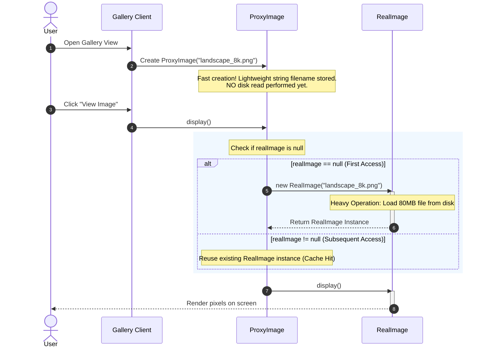

# Module 4: Low-Level Design Walkthroughs: Image Viewer & Database Security Proxy

## 1. Introduction

In LLD interviews (e.g., Google, Amazon, Microsoft, Uber), interviewers frequently evaluate your mastery of structural patterns through practical domain problems. 

This module presents end-to-end design walkthroughs for two quintessential LLD interview problems:
1. **High-Resolution Image Viewer with Lazy Loading & Caching (Virtual & Caching Proxy)**
2. **Secure Database Query Executor with Access Control & Rate Limiting (Protection Proxy)**

---

## 2. Problem Walkthrough 1: High-Resolution Image Viewer System

### System Requirements
* **Goal**: Build an image rendering system for a digital art desktop gallery.
* **Constraints**:
  1. The gallery lists 500+ high-resolution 8K images (each ~80MB).
  2. Loading all images into memory upfront leads to `OutOfMemoryError` and long startup times.
  3. Images must be loaded from disk/network **only when explicitly requested/rendered**.
  4. Once an image is loaded, subsequent rendering calls should reuse the cached image buffer rather than re-reading disk.

---

### Object Design & Class Hierarchy

```text
                     ┌────────────────────────┐
                     │     <<interface>>      │
                     │         Image          │
                     ├────────────────────────┤
                     │ + display(): void      │
                     │ + getFileName(): String│
                     └───────────▲────────────┘
                                 │
                 ┌───────────────┴───────────────┐
                 │                               │
    ┌────────────┴───────────┐       ┌───────────┴────────────┐
    │       RealImage        │       │       ProxyImage       │
    ├────────────────────────┤       ├────────────────────────┤
    │ - fileName: String     │       │ - fileName: String     │
    │ - diskData: byte[]     │       │ - realImage: RealImage │
    ├────────────────────────┤       ├────────────────────────┤
    │ + display(): void      │       │ + display(): void      │
    │ - loadFromDisk(): void │       │ + getFileName(): String│
    └────────────────────────┘       └────────────────────────┘
```

---

### Mermaid Execution Sequence



---

### Step-by-Step Design Breakdown

1. **Lightweight Initialization**:
   `ProxyImage` takes only the `fileName` (String, 32 bytes) during construction. Instantiating 1,000 `ProxyImage` instances consumes < 50 KB of memory.

2. **On-Demand Disk Reading**:
   The disk read logic resides inside `RealImage.loadFromDisk()`. This code is triggered **only** inside `ProxyImage.display()` when `realImage == null`.

3. **In-Memory Caching**:
   After the first `display()` invocation, `realImage` holds a reference to the loaded `RealImage`. Any subsequent calls to `display()` bypass disk access completely.

---

## 3. Problem Walkthrough 2: Database Access Security & Rate Limiting System

### System Requirements
* **Goal**: Build a database query execution client for an enterprise application.
* **Constraints**:
  1. **Access Control**: Users with `ADMIN` role can execute any SQL command (`SELECT`, `INSERT`, `UPDATE`, `DELETE`). Users with `USER` role can only execute `SELECT` queries. Users with `GUEST` role are denied all database access.
  2. **Destructive Query Protection**: Destructive statements like `DROP DATABASE` or `TRUNCATE TABLE` are blocked across all roles.
  3. **Rate Limiting**: Restrict clients to a maximum threshold of query executions per minute to prevent DB engine overload.

---

### Component Architecture

```text
┌────────────┐               ┌──────────────────────────────────────────────────┐
│   Client   │ ────────────► │        ProtectionProxyDatabaseExecutor           │
└────────────┘ executeQuery()├──────────────────────────────────────────────────┤
                             │ - realExecutor: RealDatabaseExecutor             │
                             │ - rateLimiter: QueryRateLimiter                  │
                             ├──────────────────────────────────────────────────┤
                             │ + executeQuery(User user, String sql): Response  │
                             │ - isQueryAllowed(UserRole, String sql): boolean  │
                             └────────────────────────┬─────────────────────────┘
                                                      │
                                                      │ Delegates if safe
                                                      ▼
                             ┌──────────────────────────────────────────────────┐
                             │               RealDatabaseExecutor               │
                             ├──────────────────────────────────────────────────┤
                             │ + executeQuery(User user, String sql): Response  │
                             └──────────────────────────────────────────────────┘
```

---

### Detailed Request Validation Pipeline

```text
Incoming Request: executeQuery(user, sql)
                     │
                     ▼
       ┌───────────────────────────┐
       │   1. Destructive Check    │ ── Contains "DROP" / "TRUNCATE"? ──► YES ──► Throw SecurityException
       └─────────────┬─────────────┘
                     │ NO
                     ▼
       ┌───────────────────────────┐
       │   2. Role Authorization   │ ── User == GUEST? ───────────────► YES ──► Throw AccessDeniedException
       └─────────────┬─────────────┘    User == USER && sql != SELECT? ─► YES ──► Throw AccessDeniedException
                     │ Authorized
                     ▼
       ┌───────────────────────────┐
       │   3. Rate Limit Check     │ ── Requests in last minute > Max? ─► YES ──► Throw RateLimitExceededException
       └─────────────┬─────────────┘
                     │ Allowed
                     ▼
       ┌───────────────────────────┐
       │  4. Delegate Execution    │ ── realExecutor.executeQuery(user, sql)
       └───────────────────────────┘
```

---

## 4. Key Design Takeaways for Interview Coding

1. **Always program to an Interface**: Ensure both `Proxy` and `RealSubject` implement the same contract (`Image` or `DatabaseExecutor`).
2. **Never expose `RealSubject` directly**: Keep `RealSubject` constructors package-private or restricted so callers must pass through the `Proxy`.
3. **Chain concerns cleanly**: A Proxy can encapsulate multiple validation rules (e.g., Security -> Rate Limiting -> Caching -> Delegation) in a single clean pass.
