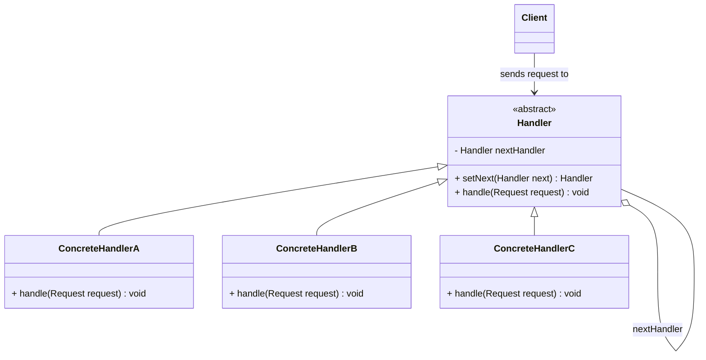

# 🔗 Chain of Responsibility Design Pattern - Introduction & Concepts

## 1. Executive Summary & Overview

The **Chain of Responsibility** is a **Behavioral Design Pattern** that lets you pass requests along a chain of handlers. Upon receiving a request, each handler decides either to process the request or to pass it to the next handler in the chain.

Key takeaways:
* **Decouples** the sender of a request from its receivers.
* **Gives multiple objects** a chance to handle the request without the sender needing to know which specific object will process it.
* **Fosters the Open/Closed Principle (OCP)**: You can introduce new handlers into the app without breaking existing client code.

---

## 2. Real-World Analogies

### Analogy 1: Corporate Expense Approval Hierarchy
Imagine an employee requesting an expense reimbursement at a company:
* **Amount ≤ $500**: Handled directly by **Team Manager**.
* **Amount ≤ $5,000**: Manager escalates to **Department Director**.
* **Amount ≤ $50,000**: Director escalates to **Vice President (VP)**.
* **Amount > $50,000**: VP escalates to **CEO / Board of Directors**.

```
  [Employee Request ($3,500)]
               │
               ▼
      ┌─────────────────┐
      │  Team Manager   │  ---> Can handle ≤ $500? NO! Pass to next.
      └────────┬────────┘
               │
               ▼
      ┌─────────────────┐
      │    Director     │  ---> Can handle ≤ $5,000? YES! Process & stop.
      └────────┬────────┘
               │ (handled)
              Done
```

The employee doesn't manually figure out who handles $3,500. They submit the request to the *first* link in the chain (Team Manager), and the chain routes it automatically to the right decision-maker.

---

### Analogy 2: Automated Customer Technical Support Call Center
When calling tech support:
1. **Tier 1 (Automated IVR / Bot)**: Answers basic questions (password resets, bill queries).
2. **Tier 2 (Helpdesk Representative)**: Handles standard technical issues (router configuration, software glitches).
3. **Tier 3 (Senior Systems Specialist)**: Resolves deep network failures or hardware defects.
4. **Tier 4 (DevOps / Engineering Team)**: Fixes core infrastructure bugs.

If Tier 1 cannot resolve your issue, it transfers (passes request) to Tier 2, and so on.

---

### Analogy 3: ATM Cash Dispenser Algorithm
When withdrawing $380 from an ATM machine:
* The machine delegates the withdrawal to a chain of bill handlers:
  * **$100 Bill Handler**: Dispenses 3 notes of $100 ($300 total), remaining = $80. Passes to next.
  * **$50 Bill Handler**: Dispenses 1 note of $50 ($50 total), remaining = $30. Passes to next.
  * **$20 Bill Handler**: Dispenses 1 note of $20 ($20 total), remaining = $10. Passes to next.
  * **$10 Bill Handler**: Dispenses 1 note of $10 ($10 total), remaining = $0. Done!

---

## 3. Problem Statement & The Naive Approach

### The Procedural / Monolithic Anti-Pattern

Consider a web application handling an incoming HTTP request. Before executing business logic, the application must perform several checks:
1. **Authentication**: Is the user logged in?
2. **Authorization / Permissions**: Does the user have `ADMIN` role?
3. **Rate Limiting**: Has the IP exceeded 100 requests/minute?
4. **Input Sanitization**: Is the payload free of XSS/SQL Injection scripts?
5. **Caching**: Is the response already cached?

#### Naive Implementation (God Method with Nested `if-else`)

```java
public class RequestHandler {
    public void handleRequest(Request request) {
        // Step 1: Authentication
        if (request.isAuthenticated()) {
            // Step 2: Rate Limiting
            if (!RateLimiter.isExceeded(request.getIp())) {
                // Step 3: Authorization
                if (request.getUser().hasRole("ADMIN")) {
                    // Step 4: Sanitization
                    if (Sanitizer.isValid(request.getData())) {
                        // Business Logic
                        System.out.println("Processing business logic...");
                    } else {
                        System.out.println("Invalid payload detected.");
                    }
                } else {
                    System.out.println("403 Forbidden: Insufficient permissions.");
                }
            } else {
                System.out.println("429 Too Many Requests.");
            }
        } else {
            System.out.println("401 Unauthorized.");
        }
    }
}
```

### Flaws of the Naive Approach
1. **Violation of Single Responsibility Principle (SRP)**: A single class controls auth, security, rate limiting, and business processing.
2. **Violation of Open/Closed Principle (OCP)**: Adding a new check (e.g., GEO-IP restriction or DDoS protection) forces modification and re-testing of the entire monolithic class.
3. **Deep Nesting ("Arrow Anti-Pattern")**: Code becomes hard to read, maintain, and unit test.
4. **Inflexible Order**: You cannot change the order of checks dynamically at runtime.

---

## 4. The Solution: Chain of Responsibility Pattern

Instead of performing all checks inside one method, transform each verification step into a **standalone object** called a **Handler**.

Each handler contains:
1. A reference to the **next handler** in the chain (`nextHandler`).
2. A method to process the request (`handle(Request request)`).

```
   [ Client ]
       │
       ▼
┌──────────────┐      ┌──────────────┐      ┌──────────────┐      ┌──────────────┐
│ AuthHandler  │───>  │ RateLimiter  │───>  │ RoleChecker  │───>  │ BusinessLogic│
└──────────────┘      └──────────────┘      └──────────────┘      └──────────────┘
```

When a request comes in:
- `AuthHandler` executes. If valid, calls `nextHandler.handle(request)`.
- `RateLimiter` executes. If valid, calls `nextHandler.handle(request)`.
- If any check fails, the handler **short-circuits** the chain and returns an error response immediately.

---

## 5. Structural Architecture & UML Diagram

### Class Diagram



### Components Summary

| Component | Role / Responsibility |
|-----------|----------------──────|
| **Request** | Holds the data payload/context passed along the chain. |
| **Handler (Interface / Abstract Class)** | Declares an interface common to all handlers; manages link to `nextHandler`. |
| **BaseHandler (Optional)** | Implements boilerplate successor management code (`setNext`). |
| **ConcreteHandlers** | Contain actual processing logic. Decides whether to handle request and whether to pass along. |
| **Client** | Assembles the chain dynamically and triggers execution on the head handler. |

---

## 6. Key Characteristics & When to Use

### Use Chain of Responsibility when:
* Multiple objects can handle a request, and the handler isn't known *a priori*.
* You want to issue a request to one of several objects without specifying the receiver explicitly.
* The set of objects that can handle a request should be specified dynamically (at runtime).
* You want to execute multiple handlers in a strict sequential order (middleware pipeline).

---

## 7. Next Steps

Proceed to [02_Step_by_Step_Implementation.md](file:///home/faujdar/Desktop/System_Design/LLD/behavioural/chain_of_responsibility/02_Step_by_Step_Implementation.md) for a detailed, line-by-line coding implementation from scratch in Java and C++.
